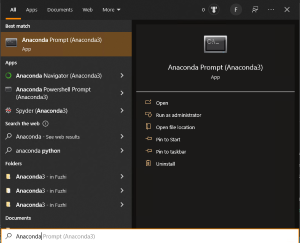

# Instruction

This instruction will show you how to deploy a FastApi server for the AI School of BIGMAP.
It involves the installation of anaconda (skip this step if you have anaconda already or are familiar with its environments), the creation of a provided python/anaconda environment and the start of the FastApi server

---
## Python already present

If python is already up and running on your machine, use the [requirements.txt](/tutorial/requirements.txt) to install all missing packages. If you don´t have python installed, skip to the next session.

```
pip install -r requirements.txt
```
---
## Installing Anaconda for Windows

1. Download the Anaconda Installer here: [Anaconda Download](https://www.anaconda.com/products/individual#windows)
2. Double click the installer to launch.
3. Click Next
4. Select an install for “Just Me” unless you’re installing for all users (which requires Windows Administrator privileges) and click Next.
5. Select an install for “Just Me” unless you’re installing for all users (which requires Windows Administrator privileges) and click Next.
6. Select a destination folder to install Anaconda and click the Next button.


7. Choose whether to add Anaconda to your PATH environment variable. We recommend not adding Anaconda to the PATH environment variable, since this can interfere with other software. Instead, use Anaconda software by opening Anaconda Navigator or the Anaconda Prompt from the Start Menu.
8. Choose whether to register Anaconda as your default Python. Unless you plan on installing and running multiple versions of Anaconda or multiple versions of Python, accept the default and leave this box checked.
9. Click the Install button. If you want to watch the packages Anaconda is installing, click Show Details.
10. Click the Next button.
11. After a successful installation you will see the “Thanks for installing Anaconda” dialog box:


## Lunch Anaconda Shell and Create an environment

After successful installation (you may need to restart your PC), we want to create an environment, in which we can run our instances of FastApi. In this repository, you will find a environment.yaml file, which contains all the definitions and the necessary packages for a python environment.
After opening the Anaconda Shell, we can create an environment



Navigate to the location of the folder contains the yaml file and the presentation_1.py file with cd (change directory)

```
cd <path-to-folder>
```

For example:

```
cd C:\Users\Fuzhi\Documents\GitHub\AI_school_bigmap_2022
```

Afterwards, execute the following command to create a conda environment.

```
conda env create -f environment.yml
```

Activate the environment with the following command

```
conda activate ai_school
```

## Lunch FastAPI locally

Now that you are in the right environment, you can run the presentation_1.py script as follows:

```
python basic_fastapi_server.py
```

After the activation, the console will show something like this.


...

Copy the address where uvicorn is running (<http://127.0.0.1:5000>), add "/docs", and paste it in the browser.
If everything was successful, you will be able to see the autogenerated documentation.


